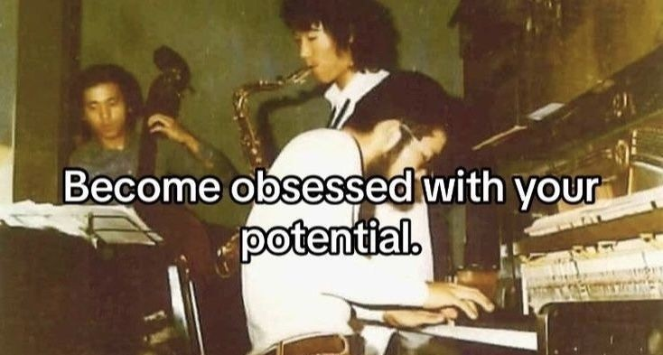

Greetings and respect,
I’m Dariush, a Computer Engineering student passionate about building intelligent systems that learn from data.

I specialize in Machine Learning and Image/Text Processing, with over 3 years of experience in diverse Data Science projects.
My expertise covers:

- Deep Neural Networks — design, training, and optimization
- Data Processing & Visualization — transforming raw data into meaningful insights
- Model Building & Fine-Tuning — designing new architectures and improving pre-trained models for real-world performance
- Computer Vision — segmentation, detection, and generative modeling
- Language Models (NLP) — from text classification to transformer-based architectures

I’m ready to collaborate on developing and improving deep neural network and language model–based solutions.

